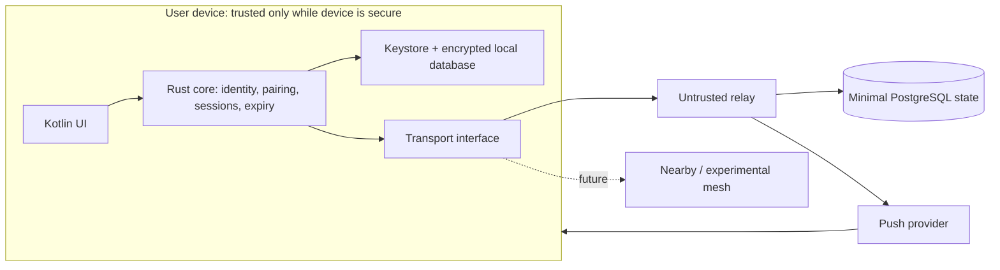
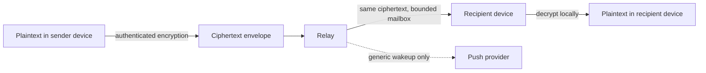

# Veil Phase 0 architecture

Veil is an Android-first, text-only, one-to-one ephemeral messenger. It is private, not anonymous: relays and network providers can still observe some metadata.

## Trust and responsibility boundaries

The device owns private identity material, local aliases, session state, and plaintext. The Rust core enforces crypto and expiry policies; Kotlin must not receive private-key export capabilities. The relay accepts authenticated, encrypted envelopes, performs bounded delivery and expiry, and never decrypts content. PostgreSQL holds only short-lived capability, rendezvous, mailbox-epoch, rate-limit, push-token, and undelivered-packet state. Push is a generic wake-up hint, not a message channel.

Local storage is separated into Keystore-protected secrets and an encrypted database. The database may contain local aliases and cached messages, but neither is uploaded. The relay has no endpoint for profiles, discovery, contacts, groups, or analytics.

## Product-state boundary

`docs/state/` is the normative product-state blueprint. UI reports only local conditions until mutual rendezvous and authenticated session establishment; a saved ID is not a request or remote lookup. The application has explicit locked, offline, suspicious-clock, and identity-loss states. Identity loss never silently creates a replacement. Conversation block/reset/destroy states are terminal for old session and mailbox authority, and unblocking never restores it. Product navigation and wording are defined in `docs/product/` and ADRs 008–009.

## Transport boundary

`SecureSession` produces and consumes opaque envelopes; `Transport` only sends, receives, and reports bounded delivery results. It must not choose ciphers, inspect plaintext, derive identities, or alter expiry. This preserves equivalent session guarantees across `InternetTransport`, future `NearbyTransport`, and `ExperimentalMeshTransport`.

Public contact capabilities and session routing are distinct: an opaque, unlinkable contact capability is used only for mutual rendezvous. The prior deterministic rendezvous representation is blocked because a relay can enumerate its live-capability corpus; no rendezvous construction is approved until review selects one that prevents that pre-match recovery. A completed session routes through a random mailbox epoch handle. Authenticated rotation creates a fresh epoch with bounded overlap; this reduces retained correlation but does not eliminate relay or push-token linkability.

## Never sent to the server

Message plaintext; private identity or session keys; local aliases; contact book; profiles; read/typing/presence state; decrypted reports unless a user explicitly selects them; plaintext notification content; and conversation-history backups.
