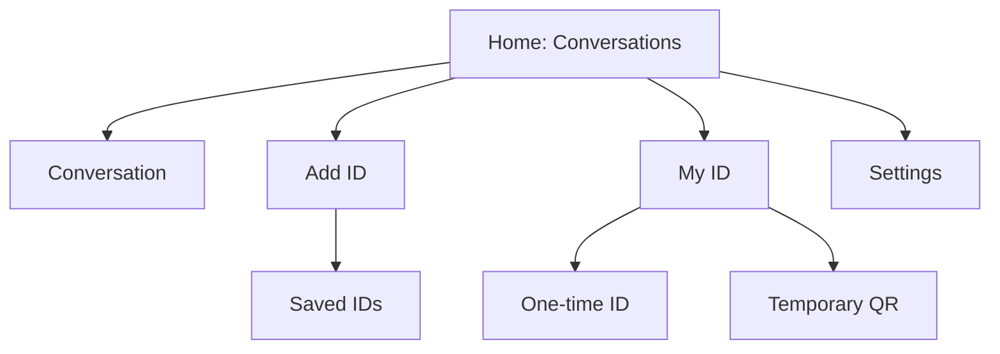

# Navigation specification

## V1 model

Use a single primary **Home / Conversations** surface, with small explicit entry points for **Add ID**, **My ID**, and **Settings**. Do not use bottom tabs: they add social-app affordances without a real V1 navigation benefit.

Home owns the root back behavior. Secondary screens push onto a normal stack and return to their origin; a conversation returns to Home. Destructive confirmations are modal and do not alter navigation until confirmed. Identity-loss, lock, and suspicious-clock states interrupt normal navigation only to the minimum safe state defined in `docs/state/`.

Unmatched saved IDs are reachable from Add ID, never mixed into Home conversations. Settings contains locally scoped privacy, notification, identity, blocked-relationship, and About entries only. No navigation route exists for profile, search, people, contacts, groups, media, or discovery.
