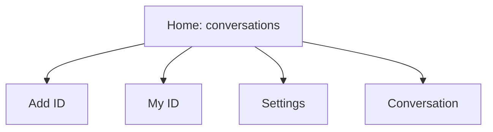

# Information architecture

Veil has a deliberately small local navigation surface:

## Home / conversations

The default screen lists established local conversations only. It may show a local alias or an abbreviated local representation of the established peer/session; it never shows a temporary pairing ID as a lasting name. No conversations uses: “No conversations. Exchange IDs with someone you know to connect.” It does not invite contact discovery or imply that someone has messaged.

## Add ID

This screen supports manual entry, paste, and QR scan only. A valid-looking entry is saved locally as a **Saved ID**; that label means solely that this device retained the entered text. There is no search, suggestion, request, pending list, remote validity check, or unilateral notification.

## My ID

Shows the current rotating ID and its local expiry/rotation information, and permits creation of one-time and QR IDs. Copy states that sharing an ID alone does not permit a message: both people must exchange and enter IDs. QR renders only a temporary pairing capability.

## Settings

Minimal sections are Privacy, Identity, Notifications, Blocked relationships, and About. Settings must not create controls for profiles, recovery, contact discovery, media, or nonexistent delivery/read status.

## Conversation

Contains a local alias, safety/identity state, text messages, composer, minimal timestamps, and lifecycle actions: verify safety code, rename local alias, block, reset secure relationship, and destroy conversation. It contains no profile image, attachments, camera, microphone, calls, typing, presence, reactions, stickers, GIFs, or link previews. Destructive actions explain their local effect and that a fresh mutual pairing is needed later.

Phase 0.9 specifies the visual realization in `docs/design/`: a single Home list without previews or unread badges in V1, text-only conversation composition, transient Sending only, and neutral local-state copy.
