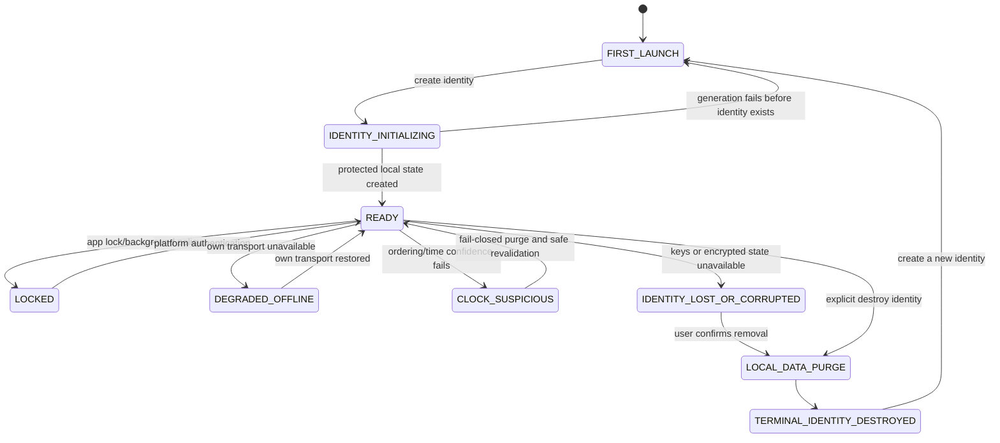

# Top-level application state machine

| State | Entry and view | Allowed / forbidden | Persistence, exit, and privacy |
|---|---|---|---|
| FIRST_LAUNCH | No usable identity; explain device ownership and irreversible loss. | Create identity; no messaging, IDs, or recovery. | No identity state. Exit only to initialization. |
| IDENTITY_INITIALIZING | Local key generation progress without account language. | Cancel only before durable creation; no navigation to product. | Never expose key material; success enters READY, failure returns to FIRST_LAUNCH with a local failure explanation. |
| READY | Normal local product. | All locally authorized actions. | Encrypted durable state; may enter lock, offline, suspicious time, or loss. |
| LOCKED | App content hidden; platform credential/biometric gate later. | Unlock; no content previews/actions. | State persists. Failure to authenticate remains locked. |
| DEGRADED_OFFLINE | Show only own condition: Offline or Unable to reach relay. | Read valid local content, compose, bounded retries. No peer-status inference. | Durable local state. Restored transport returns READY; no peer notification. |
| CLOCK_SUSPICIOUS | Privacy-safe time warning; expired data removed before display. | Inspect surviving data, resolve local time; no send/pair action whose expiry cannot be safely bounded. | Persist conservative lower bound. Exit only after fail-closed reconciliation; may force reset/early expiry. |
| IDENTITY_LOST_OR_CORRUPTED | “Old identity cannot be recovered.” | Review explanation, remove unusable local data, create a new identity afterwards. No silent replacement, messaging, or restore. | Preserve evidence only as safely readable; inaccessible key/state is not overwritten. |
| LOCAL_DATA_PURGE | Explicit destructive confirmation/progress. | Cancel before commitment if possible; otherwise no product action. | Removes selected local identity/relationship data and denies old sessions. |
| TERMINAL_IDENTITY_DESTROYED | Identity is gone. | Create new identity. No undo/recovery. | Terminal for prior identity; peers need fresh mutual exchange. |

Failure never causes a replacement identity to be silently generated, because peers could mistake a different identity for continuity.
