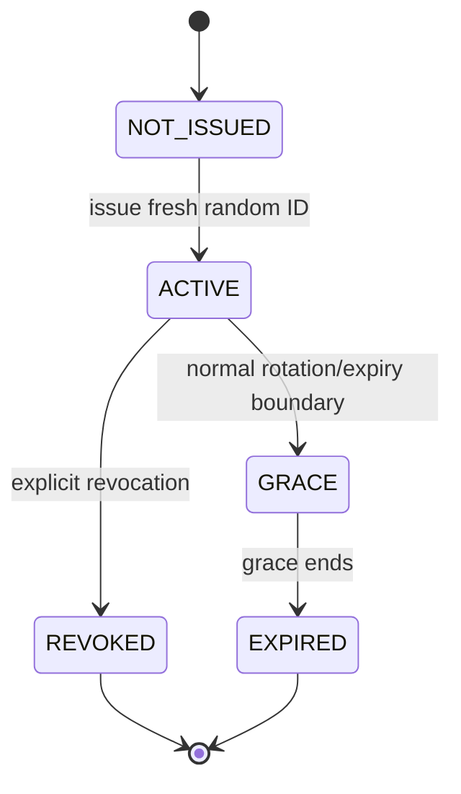
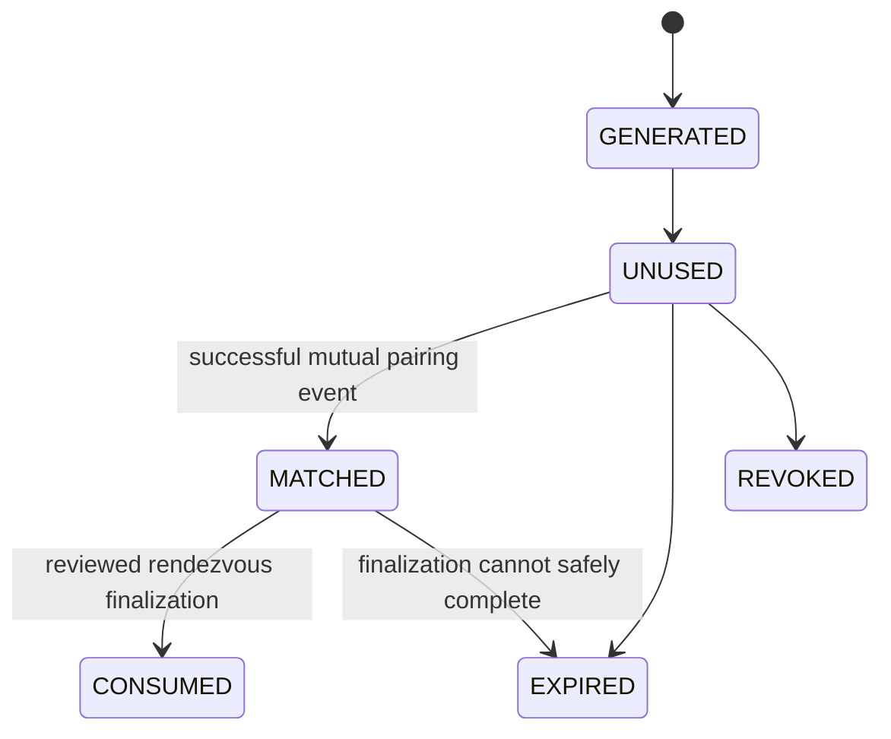
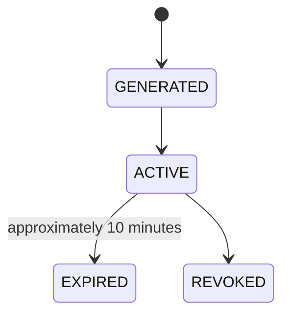

# Contact ID lifecycle

Contact IDs are temporary opaque pairing capabilities. They never encode a private key, stable identity secret/public fingerprint, local alias, contact list, or message history.

## Rotating ID

An ACTIVE rotating ID is normally shareable for seven days. At its boundary a fresh unrelated replacement is issued; the old ID enters six-hour GRACE, accepts only the architecture's already-authorized behavior, then expires. It never reveals or redirects to the replacement. Revocation invalidates only the presented ID and does not discover, notify, or link to another.

## One-time ID

Generation and local saving do not consume it. It is consumed atomically only after the final reviewed rendezvous design establishes a successful mutual pairing; that construction remains BLOCKED. Retain only the shortest reviewed replay tombstone after consumption.

## QR ID

QR is a rendering of the temporary capability only. Backgrounding, screenshotting, or scanning does not extend its lifetime, establish a connection, or disclose a peer outcome.
