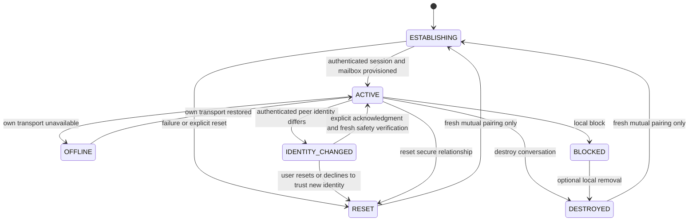

# Conversation lifecycle

| State | Meaning and allowed actions | Required boundary |
|---|---|---|
| ESTABLISHING | Pairing/handshake is being completed; no user text until authenticated. | Failure, timeout, deletion, or background resume must never imply a peer decision. |
| ACTIVE | Text may send/receive; safety verification is available. | No presence, typing, last-seen, or read state. |
| OFFLINE | The device cannot currently reach needed transport; valid local conversation remains. | May queue/retry only under protocol policy. Show only own Offline/Unable to reach relay state, never peer connectivity. |
| IDENTITY_CHANGED | Authenticated material differs from the established peer identity. Conversation is paused. | Say identity changed, not that compromise is certain. Do not silently trust, render/send new session text, or auto-continue. Explicit acknowledgment plus fresh safety-code verification is required before ACTIVE. |
| BLOCKED | Local terminal deny rule for peer/session/current and overlap mailboxes. | Discard old traffic before decrypt/render/ACK; no old session resurrection. |
| RESET | Old cryptographic session is terminal; local shell/alias may remain. | Best-effort revocation does not weaken local terminal state. Fresh mutual pairing is required. |
| DESTROYED | Relationship state is removed locally under selected deletion scope. | Fresh mutual pairing is required; stale traffic cannot recreate it. |

**Block** immediately applies the local deny state and sends best-effort authenticated revocation. **Unblock** only removes that deny state; it does not restore session material, mailbox epochs, connection, peer notification, or communication. **Reset** removes session and mailbox authority but can retain a local shell/alias. **Destroy** includes reset and removes messages and relationship state; full destroy also removes the alias. All four leave any future communication dependent on fresh current IDs and mutual pairing.
