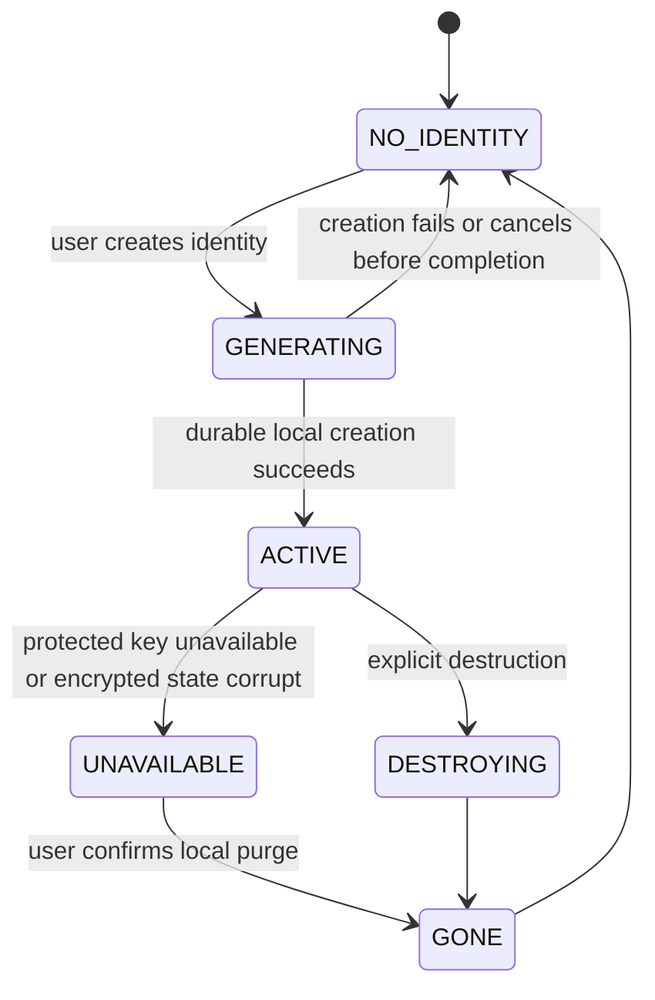

# Identity lifecycle

First launch explains that identity lives only on the device, has no login/password reset/recovery, and can be permanently lost through reinstall, app-data clearing, device loss, or protected-key loss. Generation happens locally; a failure is a local error and does not create a server-visible identity. While active, the app can issue temporary IDs and maintain secure relationships.

If hardware-backed or Keystore-protected material becomes unavailable, or encrypted state is corrupt, enter **UNAVAILABLE**. Do not guess whether repair is safe and do not silently create a replacement. Show that the old identity cannot be recovered, keep all old secure relationships paused/terminal as appropriate, and require explicit purge before a new identity is created. Device migration, account restoration, and server recovery are unsupported. Reinstall and data clear are operationally equivalent to identity loss.

Explicit destruction invalidates local use of all sessions and IDs, removes identity material through platform-appropriate deletion, and ends at **GONE**. A new identity has no continuity with the old one; old contacts must perform fresh mutual ID exchange.
