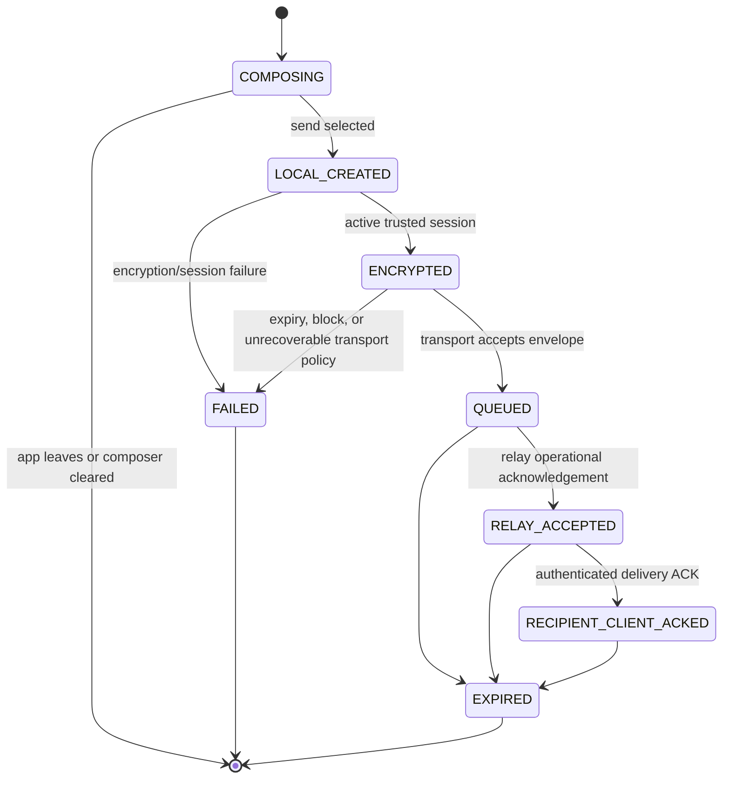

# Message lifecycle

These are implementation-facing local states, not a peer-observation channel. V1 may show only **Sending** while an outbound item has not reached `RELAY_ACCEPTED`, then **Sent**. Sent means this client received an operational relay acceptance, not that the peer received, opened, or read anything. Recipient-client ACK permits relay deletion and is never shown. If this indicator cannot be implemented without durable extra metadata, V1 may omit it; it must not substitute delivered/read semantics.

| Situation | Required behavior |
|---|---|
| Offline send / intermittent relay | Keep only an expiry-bounded encrypted queue when policy permits; retry idempotently without peer-status language. |
| App killed during send | Resume from atomically persisted local state; duplicate retries share message identity and must not produce duplicate render. |
| Duplicate retry | Relay/client idempotence handles it; no visible receipt. |
| Relay / client ACK | Operational controls only; client ACK promptly removes relay packet. |
| Expiry before delivery or after display | Purge at earliest authenticated/conservative deadline; never resurface after restart. |
| Encryption failure / unavailable session | Do not send plaintext. Show local generic send failure or require fresh pairing/reset as appropriate. |
| Suspicious clock | Fail closed: expire affected queues early and block unsafe send/pair actions. |
| Block while queued | Discard/cancel old-session queue locally; no later delivery/render/ACK from that relationship. |

There are never read, seen, opened, or recipient-view indicators. Link previews are never fetched or rendered.
