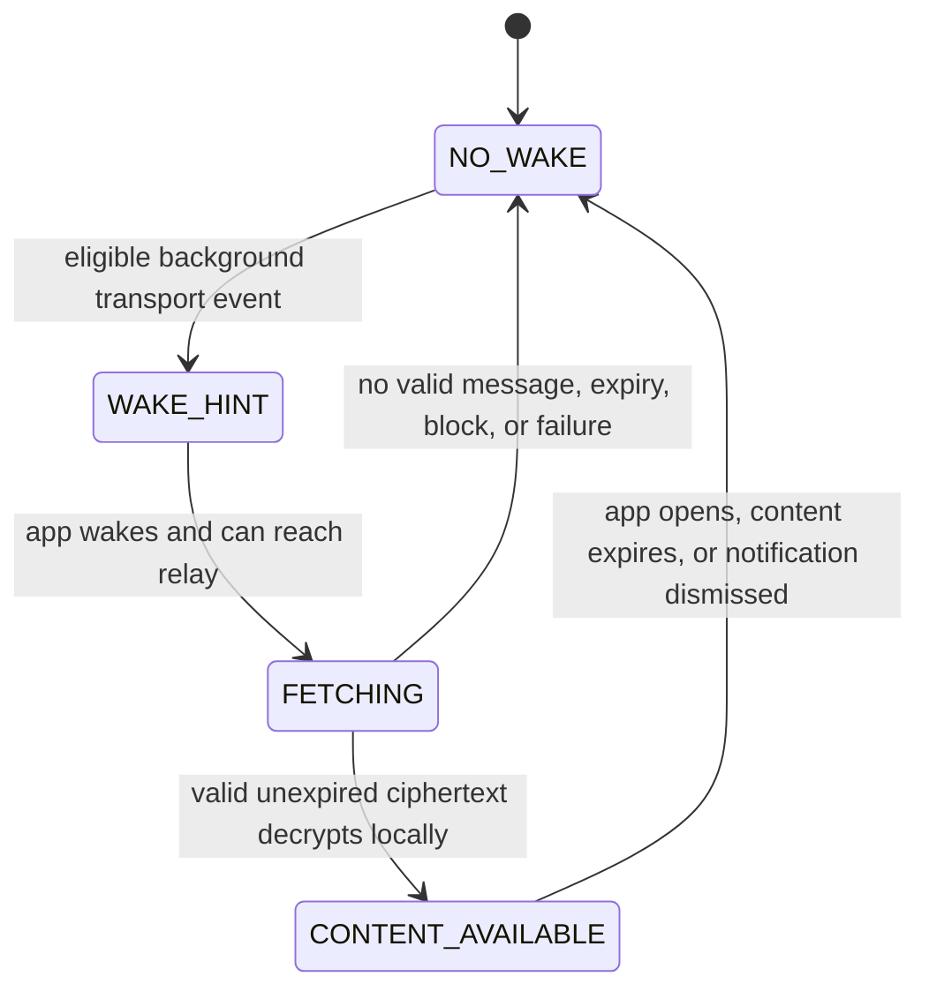

# Notification lifecycle

The only default visible notification text is **New message**. It includes no sender, alias, text, count, conversation name, ID, mailbox, preview, or conversation label. It is a wake hint and never authoritative delivery or message state.

- In foreground, Veil fetches and processes locally without a notification banner by default; the active conversation still has no read signal to the peer.
- In background, multiple wakeups may coalesce into one generic notification. No count is displayed.
- A blocked relationship produces no user-visible message notification; local block applies before decrypt/render/ACK.
- If the message is expired before fetch, fails validation, or is removed by clock safety, clear/avoid the notification without showing an expiry trace.
- Tapping after expiry opens Veil to the relevant safe local surface, not a fabricated message or “message expired” row.
- If notification permission is denied or the user disables notifications, Veil continues without push presentation; it must not claim messages are unavailable or infer peer state. Delivery can occur on the next permitted fetch.

Operating-system notification history, lock-screen rendering, and provider timing are platform limitations; generic content minimizes but does not eliminate them.
