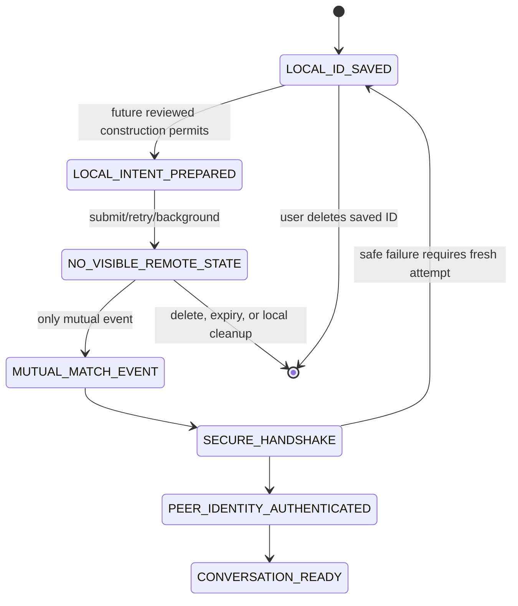

# Pairing lifecycle

This is a product state machine, not a cryptographic rendezvous design. The final mutual-rendezvous construction is **BLOCKED** by ADR 007.

| State | User-visible behavior and prohibited disclosure | Timeout, deletion, retry, background, notification |
|---|---|---|
| LOCAL_ID_SAVED | Appears only as Saved IDs. It means this device retained an entered ID. | User may delete; duplicates deduplicate locally. Background does not notify either party. |
| LOCAL_INTENT_PREPARED / NO_VISIBLE_REMOTE_STATE | No result screen, request, queue, user-found message, or peer status. | Expiry/cleanup removes local intent; retry is bounded and uniform. Background produces no unilateral notification. |
| MUTUAL_MATCH_EVENT | A local transition may begin secure handshake; it must not expose peer presence before authentication. | Failure/timeout returns to a neutral local saved state or requires fresh pairing, never a decline. |
| SECURE_HANDSHAKE | Establishing private conversation; no plaintext exchange until authenticated. | Delete/reset stops it. Retry follows reviewed protocol bounds; no push is a receipt. |
| PEER_IDENTITY_AUTHENTICATED / CONVERSATION_READY | Conversation becomes locally available; safety verification is offered. | Persist only after authenticated, atomic session establishment. |

Malformed ID and checksum failure are explicit local validation errors. Locally verifiable expiry may be shown as expired. A syntactically valid but remotely meaningless ID receives no existence oracle; any unavoidable failure is uniformly “Unable to use this ID.” An old saved rotating ID remains merely local text and does not gain a mapping when the issuer rotates. A background match produces no unilateral-save notification; a later authenticated conversation wake follows notification policy.
